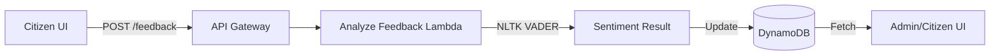

# JanSevaAI NLP & Citizen Feedback System

This document explains the architecture and operational flow of the NLP-powered sentiment analysis and feedback system implemented in JanSevaAI.

## 🏗️ System Architecture

The feedback system is a full-stack integration spanning the React frontend, AWS API Gateway, AWS Lambda, and DynamoDB.

---

## 📝 Citizen Feedback Lifecycle

### 1. Availability
The **Citizen Feedback** module only appears on the Complaint Detail page when a complaint has reached its terminal state:
- `Resolved`
- `Closed`

### 2. Access Control (Ownership)
To ensure the integrity of feedback, strict role-based access is implemented in the frontend (`ComplaintDetail.jsx`):
- **Citizen Owners**: Only the user who originally submitted the complaint (verified by phone number or name) can see the feedback submission form.
- **Admins/Workers**: They can view the results of the sentiment analysis but are blocked from submitting or editing feedback.

---

## 🧠 Backend NLP Engine (NLTK VADER)

The system uses **VADER** (Valence Aware Dictionary and sEntiment Reasoner), a specialized NLP model for sentiment analysis.

### Why VADER?
- **Speed**: Optimized for real-time processing in serverless environments.
- **Social Media Optimized**: Highly effective at understanding intensity (punctuation, case) and colloquial language used in citizen reports.
- **Governance Friendly**: Unlike heavy Large Language Models (LLMs), VADER is deterministic and highly cost-efficient.

### Sentiment Classification
The Lambda function calculates a **Compound Polarity Score** (ranging from -1.0 to 1.0):
- 🟢 **Positive**: Score ≥ 0.05
- 🟡 **Neutral**: Score > -0.05 and < 0.05
- 🔴 **Negative**: Score ≤ -0.05

---

## 💾 Data Schema (DynamoDB)

When feedback is submitted, the following fields are updated in the `Complaints` table:

| Field | Type | Description |
|---|---|---|
| `feedback_text` | String | The raw text submitted by the citizen. |
| `sentiment` | String | Classified result: "positive", "neutral", or "negative". |
| `sentiment_score` | Number | The precise compound polarity score from VADER. |
| `feedback_timestamp` | String | ISO-8601 timestamp of the submission. |

---

## ⚙️ Technical Implementation Details

### AWS Lambda Layer
The backend relies on the `nltk` and `regex` Python libraries. Because Lambda runs on Amazon Linux, we use a custom **Linux-native Lambda Layer** containing the `manylinux2014_x86_64` binaries to ensure C-extension compatibility.

### Security (JWT)
The feedback endpoint is secured via standard JanSevaAI JWT verification. The backend validates:
1. That the token is valid and not expired.
2. That the `phone` in the token matches the `user_phone` in the DynamoDB record (unless the user is an Admin).

---

## 🚀 Future Enhancements
- **Trend Analysis**: Aggregate sentiment scores per department (e.g., Road vs. Water) to identify high-performance areas.
- **Alerting**: Automatically notify local corporators or department heads if a "Highly Negative" feedback is received for a critical issue.
- **Multilingual Support**: Expanding VADER with translation layers to support regional languages like Marathi and Hindi more natively.
